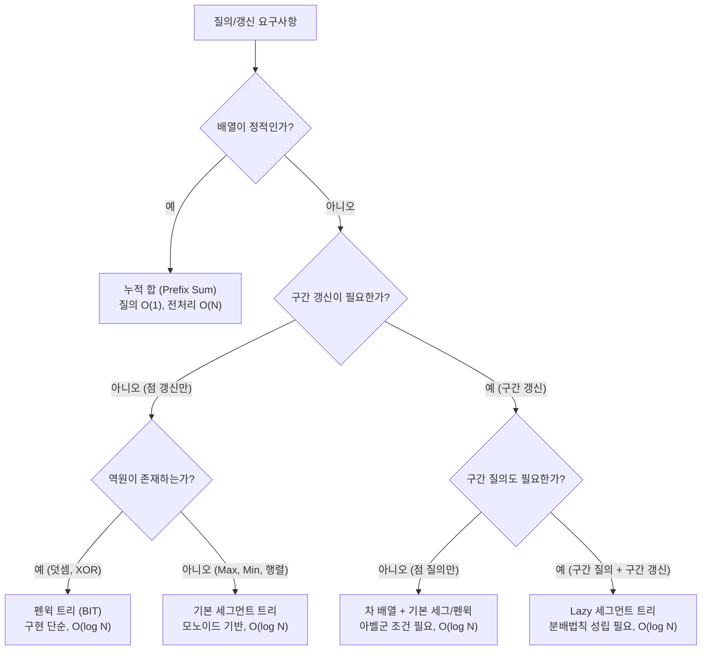

> **TL;DR (3줄 핵심 요약)**
> 1. **다루는 문제**: 원소 갱신과 구간 질의가 빈번하게 번갈아 발생하는 환경에서 단순 배열($O(N)$)이나 누적 합($O(N)$ 갱신)의 한계를 극복하고 $O(\log N)$에 처리.
> 2. **해결 아이디어**: 완전 이진 트리 구조와 대수학적 성질(**모노이드, 아벨군**)을 기반으로, 연산의 역원 유무에 따른 차 배열 테크닉, Lazy Propagation(지연 갱신), 그리고 상태 확장 기법 적용.
> 3. **최종 결론**: 단순 구간 합/최댓값을 넘어 결합법칙을 유도하는 상태 확장(금광 세그, 괄호 매칭, Dynamic DP)과 포인터/버전 관리(Dynamic, PST)로 복잡한 문제들을 정복 가능.
{: .notice--info}

---
# 01 세그먼트 트리

사전지식 : 세그먼트 트리, 머지 소트

## 스터디 목차
- 세그먼트 트리란 무엇인가?
    - 응용(Problem)
- Point update Range query -> Range Update, Point Query
    - 차 배열을 이용한 테크닉
    - 합만되나? 도와줘요 아벨군
    - 응용 
- Range update Range query ?(레이지 세그트리)
    - 레이지 세그 트리 시간복잡도 간단한 증명
    - 구현 부분
    - 레이지가 되는 조건
    - 응용
- 세그트리는 만능인가?
- 모노이드란?
- 원소에다 배열을 넣어볼까? 머지소트트리
    - 응용
- 비모노이드를 모노이드로 바꾸는 방법들
    - 응용 1 최대 연속 구간 합 (Maximum Subarray Sum) (금광 세그)
    - 응용 2 괄호 문자열의 유효성 매칭 (Bracket Matching) 
    - 응용 3 일차함수 합성 및 행렬 (Affine Transformation & Dynamic DP)
- 세그 응용
    - Dynamic Segment Tree
    - PST(Persistant Segment Tree)
    - 다차원 세그
    - 응용 
- 추가로 공부하면 좋은 것(여러분의 지적 호기심을 위해)
    - BIT 
    - Range Update, Range Query BIT

---

## 1. 세그먼트 트리란 무엇인가?

구간 쿼리(Range Query)와 원소 갱신(Point Update)을 효율적으로 처리하기 위한 완전 이진 트리 기반의 자료구조다.

- 완전 이진 트리와 같은 형식으로 데이터를 저장할 수 있다.
- 어떤 원소를 (Point update) $O(\log N)$에 갱신할 수 있다.
- 어떤 구간을 (Range query) $O(\log N)$에 질의할 수 있다.



### 응용 (Problem)

#### 구간 합
* 특정 구간 $[L, R]$의 원소 합 $\sum_{i=L}^{R} A[i]$를 $O(\log N)$에 계산.
* **예시**: 배열 $A = [1, 3, 5, 7, 9, 11]$에서 구간 $[2, 4]$의 구간 합 질의 $\to$ $A[2] + A[3] + A[4] = 3 + 5 + 7 = 15$를 $O(\log N)$에 도출.

#### 구간 최댓값
* 특정 구간 $[L, R]$ 내의 최댓값 $\max_{i=L}^{R} A[i]$를 $O(\log N)$에 질의.
* **예시**: 배열 $A = [2, 8, 5, 3, 9, 1]$에서 구간 $[1, 3]$의 최댓값 질의 $\to$ $\max(2, 8, 5) = 8$을 $O(\log N)$에 도출.

#### K번째 원소 찾기
* 세그먼트 트리 상에서 이분 탐색(Binary Search on Segment Tree)을 수행하여 $O(\log N)$에 $K$번째 원소 탐색.
* **예시**: 각 원소의 등장 횟수를 관리하는 카운팅 세그먼트 트리에서, 왼쪽 자식의 원소 개수가 $K$ 이상이면 왼쪽 서브트리로 이동하고, $K$ 미만이면 $K \leftarrow K - \text{left\_count}$ 후 오른쪽 서브트리로 이동하여 $O(\log N)$에 $K$번째 원소의 인덱스를 탐색.

---

## 2. Point update Range query -> Range Update, Point Query

기본적으로 Point Update, Range Query인데 Range Update, Point Query하는 방법이 있을까?

### 차 배열(Difference Array)을 이용한 테크닉

원래 배열이 $A$일 때, 차 배열 $D$를 $D[i] = A[i] - A[i-1]$로 정의한다. (단, $A[0] = 0$)

* **배열 예시 (1-indexed, $N=5$, $A[0]=0$):**
  * **원본 배열 예시 $A$**: $[0, 3, 7, 2, 5, 8]$
  * **차 배열 예시 $D$ ($D[i] = A[i] - A[i-1]$)**: $[0, 3, 4, -5, 3, 3]$
  * **누적 차 배열 예시 $\text{prefix\_sum}(D)$**:
    * $X=1 \implies 3 = A[1]$
    * $X=2 \implies 3 + 4 = 7 = A[2]$
    * $X=3 \implies 3 + 4 - 5 = 2 = A[3]$
    * $X=4 \implies 3 + 4 - 5 + 3 = 5 = A[4]$
    * $X=5 \implies 3 + 4 - 5 + 3 + 3 = 8 = A[5]$
    * 즉, $\sum_{i=1}^{X} D[i] = A[X]$ 관계가 성립함.

* **구간 갱신 적용 예시 ($L=2, R=4$ 구간에 $V=+3$ 더하기):**
  * 갱신 후 원본 $A$의 목표 상태: $[0, 3, \mathbf{10}, \mathbf{5}, \mathbf{8}, 8]$
  * 차 배열 갱신:
    * $D[L] = D[2] \leftarrow D[2] + 3 = 4 + 3 = 7$
    * $D[R+1] = D[5] \leftarrow D[5] - 3 = 3 - 3 = 0$
  * 갱신된 차 배열 $D$: $[0, 3, \mathbf{7}, -5, 3, \mathbf{0}]$
  * 갱신 후 $\text{prefix\_sum}(D)$ 확인:
    * $X=1: 3 = A[1]$
    * $X=2: 3 + 7 = \mathbf{10} = A[2]$
    * $X=3: 3 + 7 - 5 = \mathbf{5} = A[3]$
    * $X=4: 3 + 7 - 5 + 3 = \mathbf{8} = A[4]$
    * $X=5: 3 + 7 - 5 + 3 + 0 = 8 = A[5]$
  * 구간 전체 원소를 일일이 순회하지 않고 $D[L]$과 $D[R+1]$의 **Point Update 2번**으로 구간 덧셈이 완료됨.

- **Range Update ($L$부터 $R$까지 $V$ 더하기):** $D[L]$에 $+V$, $D[R+1]$에 $-V$를 해주는 **Point Update** 2번으로 바뀐다.
- **Point Query ($A[X]$ 구하기):** $A[X] = \sum_{i=1}^{X} D[i]$ 이므로, $D$ 배열의 $1$부터 $X$까지의 합을 구하는 **Range Query**로 바뀐다.

### 합만 되나? 도와줘요 아벨군

차 배열 테크닉은 연산에 역원(Inverse element)이 존재할 때만 가능하다.
- 닫힘성 (Closure): 집합 G의 임의의 원소 a, b에 대해 연산 결과 \(a \ast b\) 역시 G의 원소이다.
- 결합법칙 (Associativity): 임의의 원소 a, b, c에 대해 \((a \ast b) \ast c = a \ast (b \ast c)\)가 성립한다.
- 항등원의 존재 (Identity Element): 모든 a ∈ G에 대해 \(a \ast e = e \ast a = a\)를 만족하는 항등원 e ∈ G가 존재한다.
- 역원의 존재 (Inverse Element): 모든 a ∈ G에 대해 \(a \ast a^{-1} = a^{-1} \ast a = e\)를 만족하는 역원 a⁻¹ ∈ G가 존재한다.
- 교환법칙 (Commutativity): G의 임의의 두 원소 a, b에 대하여 항상 \(a \ast b = b \ast a\)가 성립한다.

예시:
- **덧셈(+), XOR($\oplus$) 연산 (성립 예시)**:
  * 교환법칙이 성립하고 역원이 존재하므로(아벨군) 차 배열 적용 가능.
  * XOR 차 배열 예시: $D[i] = A[i] \oplus A[i-1]$로 정의. 구간 $[L, R]$에 $V$를 XOR할 때 $D[L] \leftarrow D[L] \oplus V$, $D[R+1] \leftarrow D[R+1] \oplus V$로 갱신.
    $V \oplus V = 0$이므로 $R+1$ 이후 구간의 누적 XOR에는 $V$의 영향이 상쇄되어 원본이 보존됨.
- **최댓값(Max), 최솟값(Min) 연산 (실패 예시)**:
  * 역원이 존재하지 않으므로 이 테크닉으로 Range Update를 처리할 수 없다. (이 경우 레이지 프로파게이션이 필요함)
  * 반례 예시: $A = [3, 5, 2]$에서 $[1, 2]$ 구간에 $\max(x, 4)$를 적용하면 $A' = [4, 5, 2]$가 되어야 함.
    그러나 최댓값 연산에는 '이전 값으로 되돌리는 역연산(역원)'이 없기 때문에, 인덱스 3에서 4의 영향을 상쇄할 수 없음.

### 응용
* 역원이 존재하는 군(Group) 연산에 대해 일반적인 세그먼트 트리나 펜윅 트리를 RUPQ 모드로 운용.
* 예: 구간 XOR 갱신 및 특정 원소의 비트 질의를 Lazy 없이 펜윅 트리 1개로 해결.

---

## 3. Range update Range query ?(레이지 세그트리)

기존의 방법 Range update -> $O(N \log N)$

꼭 리프까지 update 해야 할까? 

필요할때만 update 해보자 -> Lazy Segment Tree 

### 레이지 세그 트리 시간복잡도 간단한 증명
- 구간 쿼리나 업데이트 시, 완전 이진 트리의 각 레벨(높이)에서 탐색하는 노드의 개수는 최대 4개를 넘지 않는다.
- 트리의 높이가 $O(\log N)$이므로, 업데이트 시 나중에 자식에게 물려줄 값(Lazy)을 기록만 하고 탐색을 멈추면(Push Down 지연) $O(\log N)$이 보장된다.

* **탐색 분기 예시 (크기 $N=8$, 질의 구간 $[3, 7]$ 업데이트 시 레벨별 방문 노드)**:
  * 레벨 0: $[1, 8]$ $\to$ 질의 구간과 부분 겹침 (자식 노드로 분기)
  * 레벨 1: $[1, 4]$, $[5, 8]$ $\to$ 두 노드 모두 질의 구간과 부분 겹침 (분기)
  * 레벨 2:
    * $[1, 2]$: 겹치지 않음 $\to$ 탐색 즉시 중단 (방문 1개)
    * $[3, 4]$: 질의 구간에 **완전 포함** $\to$ Lazy 기록 후 즉시 리턴 (방문 1개)
    * $[5, 6]$: 질의 구간에 **완전 포함** $\to$ Lazy 기록 후 즉시 리턴 (방문 1개)
    * $[7, 8]$: 부분 겹침 $\to$ 분기 진행 (방문 1개)
  * 레벨 3: $[7, 7]$ (완전 포함 리턴), $[8, 8]$ (범위 밖 리턴)
  * $\implies$ 트리의 어떤 레벨에서도 '부분 겹침으로 자식을 탐색하는 노드'는 구간의 양 경계($L, R$)를 포함하는 최대 2개뿐이며, '완전 포함되어 멈추는 노드' 최대 2개를 합쳐 **한 층에서 방문하는 노드 수는 최대 4개**로 한정됩니다.

### 구현 부분

- `lazy` 배열을 따로 두어, 해당 노드가 대표하는 구간 전체에 적용되어야 할 변화량을 저장한다.
- 자식 노드로 내려가야 할 때만 `lazy` 값을 물려주는 `push_down()` (또는 `propagate()`) 함수를 호출하여 시간 복잡도를 방어한다.

```cpp
// update 예시 코드
void push_down(int node, int s, int e) {
    if (lazy[node] == 0) return;
    int m = (s + e) >> 1;
    tree[node * 2] += lazy[node] * (m - s + 1);
    lazy[node * 2] += lazy[node];
    tree[node * 2 + 1] += lazy[node] * (e - m);
    lazy[node * 2 + 1] += lazy[node];
    lazy[node] = 0;
}

void update_range(int node, int s, int e, int l, int r, long long val) {
    if (r < s || e < l) return;
    if (l <= s && e <= r) {
        tree[node] += val * (e - s + 1);
        lazy[node] += val;
        return;
    }
    push_down(node, s, e);
    int m = (s + e) >> 1;
    update_range(node * 2, s, m, l, r, val);
    update_range(node * 2 + 1, m + 1, e, l, r, val);
    tree[node] = tree[node * 2] + tree[node * 2 + 1];
}
```

```cpp
// query 예시 코드
long long query_range(int node, int s, int e, int l, int r) {
    if (r < s || e < l) return 0;
    if (l <= s && e <= r) return tree[node];
    push_down(node, s, e);
    int m = (s + e) >> 1;
    return query_range(node * 2, s, m, l, r) + query_range(node * 2 + 1, m + 1, e, l, r);
}
```

- 예: 구간 합에 구간 덧셈 적용 $\rightarrow$ `tree[node] += lazy * (구간의 길이)`

### 레이지가 되는 조건

모든 연산이 레이지를 적용할 수 있는 것은 아니다. 분배법칙(Distributive property)이 성립하거나, 구간의 길이 등을 이용해 자식들을 순회하지 않고도 구간 전체의 결괏값을 $O(1)$에 계산할 수 있어야 한다.

* **연산별 Lazy 적용 예시**:
  * **구간 합 세그먼트 트리 + 구간 덧셈 갱신**: 분배법칙이 성립하므로 `tree[node] += lazy * (구간의 길이)`.
  * **구간 최댓값 세그먼트 트리 + 구간 덧셈 갱신**: 모든 원소에 같은 값이 더해지면 최댓값도 그대로 더해지므로 `tree[node] += lazy` (길이를 곱하지 않음).
  * **구간 합 세그먼트 트리 + 구간 값 대입(Assignment) 갱신**: 모든 원소가 `lazy`로 대체되므로 `tree[node] = lazy * (구간의 길이)`.

### 응용
* 구간 덧셈 및 구간 합 질의, 구간 값 변경 및 구간 최댓값 질의 등 복합 연산 질의.
* 예: Codeforces 242E (구간 XOR 갱신 후 구간 합 질의 - 각 비트별로 Lazy 세그먼트 트리를 구축하여 해결).

---

## 4. 세그트리는 만능인가?

아니다. 다음과 같은 질의에 대해서는 기본 세그먼트 트리를 사용할 수 없다.

- **비모노이드(Non-Monoid) 연산들:** 평균 구하기, 최빈값 구하기 등. 부분 구간의 결과를 합쳐서 전체 구간의 결과를 도출할 수 없는 연산들.
* **불가 예시 (평균 구하기)**: 구간 A의 평균이 4이고 구간 B의 평균이 6일 때, 두 구간의 원소 개수를 모르면 합친 구간의 평균을 결합할 수 없음 (결합법칙 불성립).

---

## 5. 모노이드란?

대수학에서 세그먼트 트리가 성립하기 위한 수학적 기반. 다음 세 가지 조건을 만족하는 집합 $S$와 이항 연산 $\circ$을 의미한다.

1. **닫혀있음 (Closure):** $a, b \in S$ 이면 $a \circ b \in S$
2. **결합법칙 (Associativity):** $(a \circ b) \circ c = a \circ (b \circ c)$. (왼쪽 자식과 오른쪽 자식을 어떻게 묶어서 연산하든 결과가 같아야 세그먼트 트리를 구축할 수 있다)
3. **항등원 (Identity Element):** $a \circ e = e \circ a = a$ 를 만족하는 $e$가 존재해야 함. (예: 덧셈의 0, 곱셈의 1, 최댓값의 $-\infty$)

**모노이드 연산과 비모노이드 리스트업**

- **모노이드:** 덧셈(+), 곱셈($\times$), Max, Min, GCD, LCM, XOR, 행렬 곱셈
- **비모노이드:** 뺄셈(-), 나눗셈(/), 평균, 중앙값

| 연산 | 항등원 ($e$) | 결합법칙 | 세그먼트 트리 직접 구현 여부 |
| :--- | :--- | :--- | :--- |
| 덧셈 (+) | $0$ | 성립 | 가능 |
| 곱셈 ($\times$) | $1$ | 성립 | 가능 |
| Max | $-\infty$ | 성립 | 가능 |
| Min | $+\infty$ | 성립 | 가능 |
| GCD | $0$ | 성립 | 가능 |
| LCM | $1$ | 성립 | 가능 |
| XOR ($\oplus$) | $0$ | 성립 | 가능 |
| 행렬 곱셈 | 단위행렬 ($I$) | 성립 | 가능 |
| 뺄셈 (-) | 없음 | 불성립 | 불가 |
| 나눗셈 (/) | 없음 | 불성립 | 불가 |
| 평균 | 없음 | 불성립 | 상태 확장(합, 개수) 필요 |
| 중앙값 | 없음 | 불성립 | 머지소트트리 / PST 등 필요 |

---

## 6. 원소에다 배열을 넣어볼까? 머지소트트리

세그먼트 트리의 각 노드가 단일 값이 아니라 **정렬된 배열**을 가지게 하는 자료구조.

- 정렬된 두 배열을 병합(Merge)하여 하나의 정렬된 배열로 만드는 연산은 **결합법칙**이 성립하므로 모노이드다.

### 응용
- **응용:** "특정 구간 $[L, R]$에서 $K$보다 작은 원소의 개수는?" $\rightarrow$ 각 노드가 관리하는 배열에서 이분 탐색(Upper bound)을 진행. 질의당 $O(\log^2 N)$에 해결 가능.
* **질의 동작 예시 ($A = [5, 1, 8, 3, 7, 2, 6, 4]$, 구간 $[2, 6]$에서 $5$ 이하 원소의 개수)**:
  * 구간 $[2, 6]$은 트리의 노드 $[2, 2](=[1])$, $[3, 4](=[3, 8])$, $[5, 6](=[2, 7])$의 합집합으로 표현됨.
  * 각 노드의 정렬된 벡터에서 `upper_bound(5)`를 수행:
    * 노드 $[2, 2]$: $[1] \implies 1$개
    * 노드 $[3, 4]$: $[3, 8] \implies 1$개 ($3$)
    * 노드 $[5, 6]$: $[2, 7] \implies 1$개 ($2$)
  * 결과: $1 + 1 + 1 = 3$개를 $O(\log^2 N)$에 판별.
- **추천 응용 문제:** Codeforces의 구간 내 원소 빈도수 및 K번째 수 관련 쿼리 문제들.

---

## 7. 비모노이드를 모노이드로 바꾸는 방법들

결합법칙이 성립하지 않는 것처럼 보이는 문제도, 관리하는 상태(State)를 확장하면 모노이드로 바꿀 수 있다.

### 응용 1 최대 연속 구간 합 (Maximum Subarray Sum) (금광 세그)

- 단순 최댓값만 저장하면 두 구간을 합칠 때 중간에 걸치는 구간 합을 알 수 없다.
- **해결:** 노드마다 4개의 값 `(sum, lmax, rmax, max)`을 저장하여 병합한다. 이 4튜플을 병합하는 연산은 결합법칙이 성립한다.

* **병합 계산 예시**:
  * 왼쪽 노드: $L = [-2, 5, 3] \implies \text{sum}=6, \; \text{lmax}=6, \; \text{rmax}=8, \; \text{max}=8$
  * 오른쪽 노드: $R = [4, -1, 2] \implies \text{sum}=5, \; \text{lmax}=5, \; \text{rmax}=5, \; \text{max}=5$
  * 병합 노드 계산:
    * $\text{res.sum} = 6 + 5 = 11$
    * $\text{res.lmax} = \max(6, 6 + 5) = 11$
    * $\text{res.rmax} = \max(5, 5 + 8) = 13$
    * $\text{res.max} = \max(\{8, 5, 8 + 5\}) = 13$ (경계에 걸치는 연속 구간 $[5, 3] + [4, -1, 2]$의 합 $8+5=13$)

```cpp
// 예시 코드
struct Node {
    long long sum, lmax, rmax, max_sub;
};

Node merge(const Node& l, const Node& r) {
    Node res;
    res.sum = l.sum + r.sum;
    res.lmax = max(l.lmax, l.sum + r.lmax);
    res.rmax = max(r.rmax, r.sum + l.rmax);
    res.max_sub = max({l.max_sub, r.max_sub, l.rmax + r.lmax});
    return res;
}
```

스위핑하면 이차원에서 사용가능하고 이게 금광 세그임

### 응용 2 괄호 문자열의 유효성 매칭 (Bracket Matching)

* 올바른 괄호 문자열인지 구간 쿼리로 판별.
* **해결:** 노드마다 `(매칭되지 않은 여는 괄호 수, 매칭되지 않은 닫는 괄호 수)`를 저장. 병합 시 서로 상쇄되는 괄호를 계산해주면 결합법칙이 성립한다.

* **병합 계산 예시**:
  * 왼쪽 구간: `") ( ("` $\implies$ 매칭되지 않은 닫는 괄호 `close=1`, 여는 괄호 `open=2`, `matched=0`
  * 오른쪽 구간: `") ) ("` $\implies$ 매칭되지 않은 닫는 괄호 `close=2`, 여는 괄호 `open=1`, `matched=0`
  * 병합 시:
    * 새롭게 매칭되는 쌍: $\Delta = \min(\text{left.open}, \; \text{right.close}) = \min(2, 2) = 2$
    * 총 매칭: $0 + 0 + 2 = 2$쌍
    * 남은 `open`: $(2 - 2) + 1 = 1$개
    * 남은 `close`: $1 + (2 - 2) = 1$개
    * 병합 결과: `") ( ( ) ) ("` $\implies$ 매칭 2쌍(`()()`), 남은 괄호 `") ... ("` (`close=1, open=1`)로 완벽히 일치.

```cpp
struct Node{
    int matched, open, close;
};

Node f(Node left, Node right){
    int new_matched = min(left.open, right.close);
    int new_open = (left.open - new_matched) + right.open;
    int new_close = left.close + (right.close - new_matched);
    int total_matched = left.matched + right.matched + new_matched;
    return {total_matched, new_open, new_close};
}
```

### 응용 3 일차함수 합성 및 행렬 (Affine Transformation & Dynamic DP)
* $f(x) = ax + b$ 형태의 갱신을 구간에 적용할 때. 함수 합성은 결합법칙이 성립한다.
* **일차함수 합성 예시**:
  * $f(x) = 2x + 3$, $g(x) = 4x - 1$ 일 때:
    $$(g \circ f)(x) = 4(2x + 3) - 1 = 8x + 11$$
  * 두 함수를 합성한 결과의 새 기울기는 $4 \times 2 = 8$, 새 절편은 $4 \times 3 + (-1) = 11$로 $O(1)$에 계산 가능.
* 더 복잡한 점화식은 $2 \times 2$ 또는 $3 \times 3$ 행렬로 변환하여 세그먼트 트리에 올릴 수 있다 (행렬 곱셈은 모노이드). 이를 **Dynamic DP** 기법이라 부른다.
* **Dynamic DP 행렬 전이 예시**:
  * 피보나치 수열 $DP[i] = DP[i-1] + DP[i-2]$를 행렬 전이로 표현:
    $$\begin{pmatrix} DP[i] \\ DP[i-1] \end{pmatrix} = \begin{pmatrix} 1 & 1 \\ 1 & 0 \end{pmatrix} \begin{pmatrix} DP[i-1] \\ DP[i-2] \end{pmatrix}$$
  * 구간의 전이 행렬들을 세그먼트 트리에 올리면, 특정 시점의 전이 규칙이 변경되거나 구간 합성이 필요할 때 $O(\log N)$에 전체 결과를 갱신할 수 있음.

---

## 8. 세그 변형

### Dynamic Segment Tree
* 배열 뼈대 없이 포인터(또는 동적 배열)를 이용해 필요할 때만 노드를 생성한다.
* **장점:** 인덱스의 범위가 매우 클 때(예: $10^9$) 좌표 압축(Coordinate Compression) 없이도 $O(Q \log X)$ 공간 복잡도로 트리를 구축할 수 있다.
* **적용 예시**:
  * 좌표 범위 $X \in [1, 10^9]$, 질의 개수 $Q = 10^5$.
  * 정적 세그먼트 트리: $4 \times 10^9$개의 노드 필요 $\to$ 수십 GB로 메모리 초과(MLE).
  * Dynamic 세그먼트 트리: 갱신 1회당 경로상의 노드만 최대 $\lceil \log_2(10^9) \rceil \approx 30$개 생성.
    총 노드 수 약 $30 \times 10^5 \approx 3 \times 10^6$개 $\to$ 수십 MB 수준으로 해결 가능.

### PST(Persistant Segment Tree)
* Dynamic Segment Tree의 응용. 값이 갱신될 때 기존 노드를 덮어쓰지 않고 새로운 노드를 생성하여(버전 관리) 과거의 트리 상태를 모두 유지한다.
* **응용:** "과거 $T$ 시점의 트리 상태에서 구간 쿼리", "2D 평면에서의 쿼리를 1D PST로 차원 축소하여 풀기 (오프라인 쿼리를 온라인으로 처리)".
* **적용 예시 (구간 $[L, R]$ 내 $K$번째 수 찾기)**:
  1. 수열의 1번째 원소부터 $N$번째 원소까지 차례로 삽입하며, 각 단계마다의 트리 루트 $root[1], root[2], \dots, root[N]$을 생성 ($O(N \log N)$).
  2. 구간 $[L, R]$의 상태는 $root[R]$ 트리와 $root[L-1]$ 트리의 각 노드 차이($\text{count}_{R} - \text{count}_{L-1}$)로 $O(1)$에 복원.
  3. 세그먼트 트리 위에서 좌측 자식의 원소 개수를 확인하며 이분 탐색을 진행하여 $O(\log N)$에 $K$번째 수를 질의.

### 다차원 세그
* 트리의 각 노드가 또 다른 세그먼트 트리의 루트가 되는 구조. (세그먼트 트리 안의 세그먼트 트리)
* 2차원 평면에서의 점 업데이트 및 부분 사각형 쿼리를 $O(\log^2 N)$에 처리.
* **적용 예시 (2차원 직사각형 영역 합 질의)**:
  * 바깥쪽 $x$-세그트리의 각 노드가 구간 $[x_L, x_R]$을 담당하고, 해당 노드는 $y$ 좌표들을 관리하는 내부 $y$-세그트리의 루트를 보유.
  * 점 $(x, y)$에 값 갱신: 바깥 트리에서 $x$를 포함하는 $O(\log N)$개의 노드를 방문하고, 각 노드의 $y$-세그트리에 $y$를 갱신 ($O(\log N \log M)$).
  * 직사각형 $[x_1, x_2] \times [y_1, y_2]$ 합 질의: 바깥 트리에서 $[x_1, x_2]$를 커버하는 노드들에서 각각 $y$-세그트리의 $[y_1, y_2]$ 합을 질의하여 합산 ($O(\log N \log M)$).

### 응용 (Problems)

* **추천:** AtCoder Beginner Contest (ABC) Ex 문제들, USACO Platinum 레벨의 자료구조 문제들, Codeforces Div 1 E/F 문제들 (비모노이드의 모노이드화, Dynamic DP 문제 다수 출제).

- [CF 242E — XOR on Segment](https://codeforces.com/problemset/problem/242/E)
- [CF 380C](https://codeforces.com/problemset/problem/380/C)
- [높은 카드 낮은 카드 (Platinum)](https://jungol.co.kr/problem/3939)
- [Library Checker — Point Set Range Composite](https://judge.yosupo.jp/problem/point_set_range_composite)
- [SPOJ GSS1 — Can you answer these queries I](https://www.spoj.com/problems/GSS1/)
- [CF 180E — Cubes](https://codeforces.com/problemset/problem/180/E)
- [CF 1149C — Tree Generator™](https://codeforces.com/problemset/problem/1149/C)
- [CF 750E — New Year and Old Subsequence](https://codeforces.com/problemset/problem/750/E)
- [Library Checker — Vertex Add Path Sum](https://judge.yosupo.jp/problem/vertex_add_path_sum)
- [Library Checker — Dynamic Tree Vertex Set Path Composite](https://judge.yosupo.jp/problem/dynamic_tree_vertex_set_path_composite)
- [CF 1208D — Restore Permutation](https://codeforces.com/problemset/problem/1208/D)
- [CF 242E — XOR on Segment](https://codeforces.com/problemset/problem/242/E)
- [CF 52C — Circular RMQ](https://codeforces.com/problemset/problem/52/C)
- [USACO 2015 December Contest (Platinum) — High Card Low Card](https://www.google.com/search?q=https://www.usaco.org/index.php%253Fpage%253Dviewproblem2%2526cpid%253D577&utm_source=gemini)
- [CF 380C — Sereja and Brackets](https://codeforces.com/problemset/problem/380/C)
- [AtCoder ABC 246 Ex — 01? Queries](https://atcoder.jp/contests/abc246/tasks/abc246_h)
- [CF 915E — Physical Education Lessons](https://codeforces.com/problemset/problem/915/E)
- [AtCoder ABC 309 F — Box in Box](https://atcoder.jp/contests/abc309/tasks/abc309_f)
- [CF 893F — Subtree Minimum Query](https://codeforces.com/problemset/problem/893/F)

---

## 9. 추가로 공부하면 좋은 것(여러분의 지적 호기심을 위해)

- BIT
- Range Update, Range Query BIT  
    Lazy Propagation 없이도 두 개의 BIT를 이용해 $O(\log N)$에 Range Update와 Range Query를 모두 지원하는 수학적 트릭.